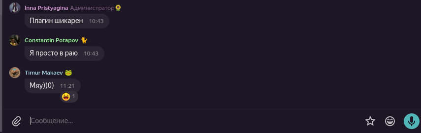
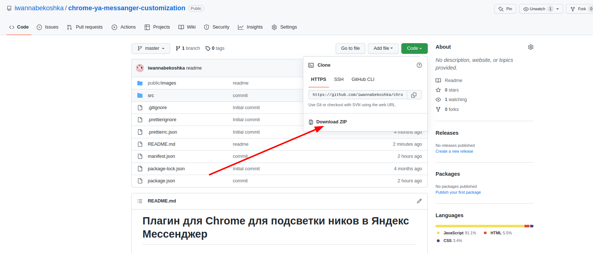

# Плагин для Chrome для подсветки ников в Яндекс Мессенджер

## Как это выглядит

### Подсветка чатов


### Подсветка ников в чате



## Установка

1. Скачать архив с плагином
   
2. Распаковать плагин в удобное для себя место
3. Зайти в [плагины хрома](chrome://extensions/)
4. Слева наверху нажать "Load unpacked", выбрать папку с плагином

## Покраска ников + доп.текст или иконки справа от них

В файле _src/main.js_ на самом верху находится массив `users`, в него добавлять объекты людей:

```js
{
  name: "Constantin Potapov",
  color: "lightgreen",
  after: "\\1F408",
},
```

- `name` - имя пользователя. Скрипт ищет совпадение в никах на экране, так что `name: "Constantine"` будет подсвечивать всех, у кого в нике есть "Constantine"
- `color` - цвет в любом формате (RGB, RGBA, HSL, HEX, названием по типу "red", "hotpink" и тд)
- `after` - текст/смайлик возле ника. Смайлики в формате **CSS-кода** можно искать тут: https://unicode-table.com/en/1F438/

При изменении юзеров надо снова зайти в [плагины хрома](chrome://extensions/), найти этот плагин и нажать на значок перезагрузки


